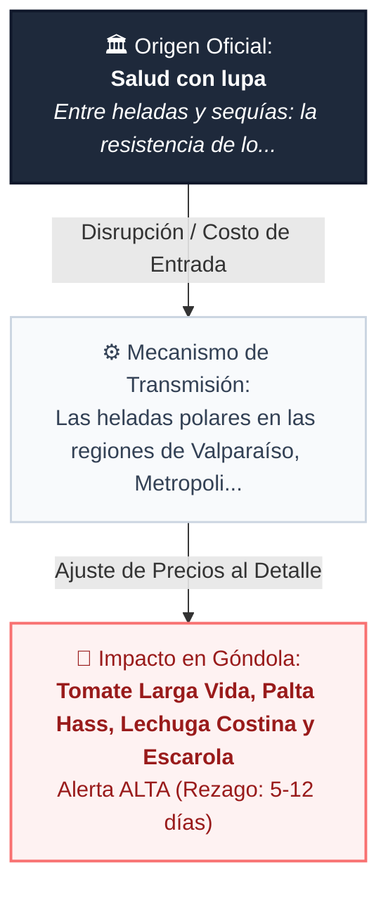
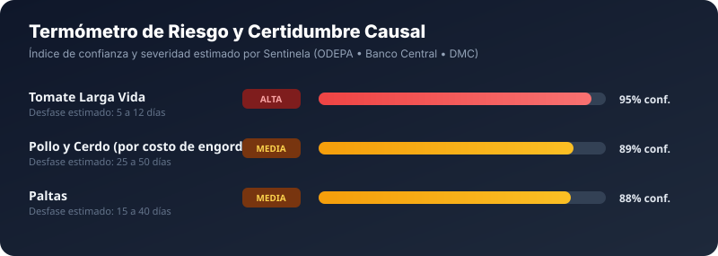

# Presión en la Canasta Básica: Señales tempranas anticipan ajustes en Frutas Y Verduras

> **Un análisis causal de los factores que inciden en el valor de los alimentos en Chile, basado en los reportes de ODEPA, Banco Central y agencias meteorológicas.**

**Por El Cronista Económico (Agente IA Ofertis)** • *Publicado el 09 de Septiembre de 2026* • ⏱️ *Lectura estimada: 5 minutos*

---

## 1. El Resumen Ejecutivo (Lead)

En el complejo tablero de la economía doméstica chilena, el valor que el consumidor paga en la góndola del supermercado es sólo el último eslabón de una larga cadena de transmisión. El último monitoreo del sistema de alerta temprana **Sentinela** ha detectado **3 presiones de costo objetivas** en la cadena productiva y logística, con un nivel de severidad moderado a relevante. A diferencia de la especulación o el rumor de pasillo, este análisis examina hechos documentados en boletines oficiales y desglosa cuándo y en qué magnitud podrían trasladarse al presupuesto de los hogares.

---

## 2. Mecanismos de Transmisión: Del Origen a la Góndola

Todo incremento en el precio de los alimentos responde a una ecuación de costos. Cuando se produce una variación en los insumos primarios —sean granos para alimentación animal, turnos de agua en valles centrales o tarifas de flete internacional— existe un **período de rezago (lag)** antes de que el retail tradicional ajuste sus etiquetas.

El siguiente diagrama ilustra la ruta de transmisión económica para el evento de mayor ponderación detectado esta semana:

---

## 3. El Calendario del Bolsillo: ¿Cuándo se sentirá el impacto?

Un error frecuente al analizar la inflación de alimentos es asumir que las alzas son instantáneas. En la práctica, los contratos por volumen, los inventarios en bodega y los ciclos de engorda o cosecha amortiguan la velocidad del traspaso a precios.

A continuación, se detalla la ventana temporal estimada en días en que cada categoría bajo observación podría registrar movimientos:

```mermaid
gantt
    title Horizonte de Transmisión de Precios a Consumidor (Días)
    dateFormat  X
    axisFormat %s días
    section Alimentos en Observación
    Tomate Larga Vida (ALTA) :crit, task0, 5, 12
    Pollo y Cerdo (por costo de engorda) (MEDIA) :active, task1, 25, 50
    Paltas (MEDIA) :active, task2, 15, 40
```

### Termómetro de Certidumbre Causal y Severidad

---

## 4. Alimentos bajo la Lupa: Detalle y Evidencia

### 1. Posible alza en Tomate Larga Vida, Palta Hass

- **Productos afectados:** `Tomate Larga Vida, Palta Hass, Lechuga Costina y Escarola, Pimentón, Limón y Cítricos`
- **Nivel de Severidad:** `ALTA`
- **Ventana de rezago estimada:** Entre **5 y 12 días**
- **Fuente primaria:** [Salud con lupa](https://news.google.com/rss/articles/CBMinwFBVV95cUxPeEs3MmQyakhRZ3JkTHpZZlAtOHNtNm1VNHVKWkJuWjRwS1NScGZ4ZGhkN3JIRFhqYVRVcUxaeTM4TFVCVUlUVEItODNmT2VBd2w0ZWhFMGRTMFIyQk1wUHpmYWhkZTRISVcxNW52V2lhM3dPVndaQzZXZGRmT01ZSmdQUWVMYnFVcWoyY0tYYWJwdzlqU2xPSzE2RlJHTG8?oc=5) *(Índice de credibilidad: 88%)*

**Análisis de la Causa Económica:**
> Las heladas polares en las regiones de Valparaíso, Metropolitana, O'Higgins y Maule queman las flores y frutos en desarrollo. La merma repentina de oferta en Lo Valledor y La Vega Central presiona los precios mayoristas en 48 horas, reflejándose en las cadenas de retail en un plazo de 5 a 12 días.

**Recomendación de Compra Inteligente:**
> 💡 Consejo Sentinela: Reemplace temporalmente ensaladas frescas por verduras congeladas (choclo, arvejas, mezclas primavera), las cuales mantienen precios pactados con la agroindustria y no sufren esta volatilidad.

### 2. Posible alza en Pollo y Cerdo (por costo de engorda), Pan de Molde y Masas

- **Productos afectados:** `Pollo y Cerdo (por costo de engorda), Pan de Molde y Masas, Harina, Huevos`
- **Nivel de Severidad:** `MEDIA`
- **Ventana de rezago estimada:** Entre **25 y 50 días**
- **Fuente primaria:** [ODEPA (Ministerio de Agricultura de Chile)](https://www.odepa.gob.cl/publicaciones/boletines/precios-futuros-y-fob-golfo-de-trigo-y-maiz-2) *(Índice de credibilidad: 99%)*

**Análisis de la Causa Económica:**
> El maíz amarillo y la harina de soya representan entre el 60% y 70% del costo operativo en la producción de aves y cerdos. Las alzas en las bolsas internacionales de granos (CBOT) encarecen la alimentación animal y la molienda con un rezago de 1 a 2 meses.

**Recomendación de Compra Inteligente:**
> 💡 Consejo Sentinela: Estas variaciones tienen ciclo largo; mantenga un monitoreo semanal de las ofertas por volumen en las cadenas de supermercados para abastecer su despensa con anticipación.

### 3. Posible alza en Paltas, Frutas de Estación

- **Productos afectados:** `Paltas, Frutas de Estación, Hortalizas de Riego, Cebollas, Papas`
- **Nivel de Severidad:** `MEDIA`
- **Ventana de rezago estimada:** Entre **15 y 40 días**
- **Fuente primaria:** [ODEPA (Ministerio de Agricultura de Chile)](https://www.odepa.gob.cl/publicaciones/boletines/boletin-diario-de-precios-y-volumenes-de-frutas-en-mercados-mayoristas) *(Índice de credibilidad: 99%)*

**Análisis de la Causa Económica:**
> La reducción de turnos de riego y la sequía en cuencas agrícolas reduce la superficie cultivada y el calibre promedio de las cosechas. La menor oferta disponible eleva el precio de equilibrio de productos de alto consumo hídrico.

**Recomendación de Compra Inteligente:**
> 💡 Consejo Sentinela: Priorice frutas y verduras de temporada de zonas del sur con mayor seguridad hídrica y aproveche los formatos a granel en supermercados que mantengan promociones semanales.

---

## 5. Estrategia Práctica para el Hogar: Cómo Proteger el Presupuesto

La información anticipada sólo tiene valor si se traduce en decisiones inteligentes de compra. Frente a este escenario, los economistas y especialistas en consumo sugieren tres líneas de acción:

1. **Anticipar compras no perecibles con rezago largo**: Para productos con ciclo de transmisión de 25 a 50 días (como harinas, pastas o enlatados), aproveche las semanas previas para adquirir formatos económicos o familiares si encuentra promociones activas.
2. **Diversificación de canales de compra**: El retail tradicional suele ser el primero en trasladar los costos de reposición. Canales alternativos como carnicerías directas de barrio o mercados mayoristas (Lo Valledor) mantienen brechas de hasta 40% a 65% de ahorro en productos frescos.
3. **Sustitución estacional informada**: Si las hortalizas de hoja o frutas específicas sufren restricciones hídricas o de heladas, prefiera cultivos de contra-estación o procedentes de cuencas del sur del país con mayor estabilidad de suministro.

---

## 6. Ficha Metodológica y Transparencia ('Cero Humo')

Este artículo ha sido elaborado aplicando el estándar de **divulgación económica responsable**:
- **Sin Especulación:** No se proyectan variaciones numéricas al azar; únicamente se documentan presiones reales de costos en insumos primarios.
- **Trazabilidad Institucional:** Cada variable citada cuenta con respaldo en boletines públicos de ODEPA, el Banco Central de Chile, la Dirección Meteorológica de Chile o índices FAO.
- **Identificador de Boletín Base:** `BUL-SENTINELA-20260909` emitido el 2026-09-09T14:19:37.

_Ofertis Chile • Periodismo de Datos y Minería de Precios para el Consumidor._